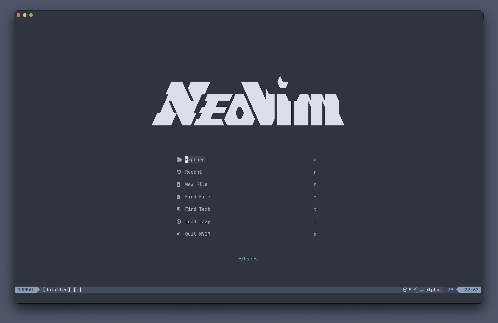
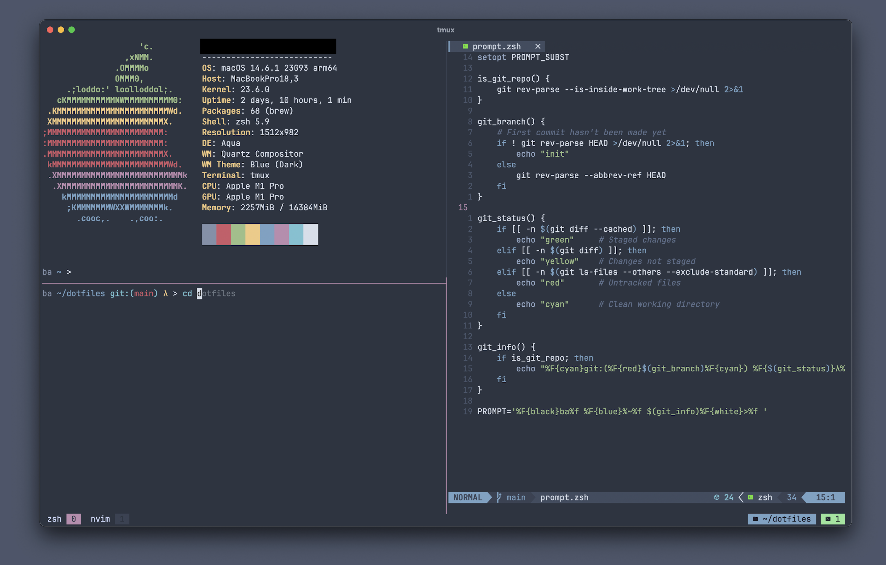

# Dotfiles

A place to better manage and showcase my dotfiles.

This repository serves as both personal documentation and a guide for others—feel free to fork it, customize it to your needs, and use it as a foundation for your own setup.

Although this configuration is simple and straightforward, keep in mind that adjustments might have to be made depending on your system.

## How It Works

GNU Stow helps manage dotfiles by creating symbolic links from your home directory to the actual configuration files stored in a version-controlled directory. This means that instead of having your dotfiles scattered throughout your home directory, you can keep them organized in one place while maintaining the expected structure for your system.

Once installed, running `stow` will create a symbolic link for each file in the directory you pass into it (except for [ignored files](https://www.gnu.org/software/stow/manual/stow.html#Ignore-Lists)), and then these will be placed inside the parent directory of where you ran the command.

For example, if you have a .zshrc file, instead of storing it directly in your home directory, you can:

1.  Store the actual file in `~/dotfiles/.zshrc`
2.  Use Stow to create a symbolic link at `~/.zshrc` that points to `~/dotfiles/.zshrc`

This approach makes it easier to:

- Track changes with version control
- Share configurations across different machines
- Keep your dotfiles organized in one central location
- Quickly deploy your entire configuration on a new system

To learn more about implementing Stow according to your own configuration or to just get a better idea of how it works, watch [this](https://www.youtube.com/watch?v=FHuwzbpTTo0&list=PLVICUuo69SVpj_kjGKeUFKJSxAKdtr4uS&index=3&t=1s).

On the other hand, if you wish to have something similar to my current configuration, then follow the steps below.

### Neovim



### Tmux



## Requirements

Install the following directly or with your preferred package manager:

- [Git](https://git-scm.com)
- [GNU Stow](https://www.gnu.org/software/stow/)
- [Neovim](https://neovim.io)
- [Tmux](https://github.com/tmux/tmux)
- [Eza](https://github.com/eza-community/eza)
- [Ripgrep](https://github.com/BurntSushi/ripgrep) (dependency for the Neovim [telescope](https://github.com/nvim-telescope/telescope.nvim?tab=readme-ov-file#getting-started) plugin)
- [Nerd Font](https://www.nerdfonts.com) (dependency for the featured Neovim icons, I use JetBrainsMono)

In terms of terminal emulators, I use [iTerm2](https://iterm2.com), but any terminal emulator that supports true color should do the job just fine. I've also included my iTerm2 json profile, which can be imported directly.

## Getting Started

Clone this dotfiles repository in your `$HOME` directory and `cd` into it:

```sh
git clone https://github.com/bastnsa/dotfiles.git
cd dotfiles
```

Use `stow .` to create a symbolic link for each file in `~/dotfiles`:

```
stow . # stow everything in the current directory
```

If you receive an error, then it's likely you have a file (or files) with matching relative paths present in your home directory. For example, it is possible that a `.zshrc` file already exists in your home directory.

My recommendation is to back up any conflicting files, then `cd` back into `~/dotfiles` and finally proceed with the previous command:

```
stow .
```

Finally, if everything went according to plan, you should see symbolic links from your home directory that link back into the dotfiles directory.


## Important to Note

#### Adding New Files

When customizing your dotfiles setup, remember that any new configuration files you add to the dotfiles directory will need to be "stowed" to create the appropriate symbolic links. After adding a new file, simply run `stow .` from within your dotfiles directory. This ensures that a symbolic link is created in your home directory that points to your new configuration file. Without this step, your system won't recognize or use the new configuration file since no symbolic link will exist.

Feel free to reach out if you need help with any issues or have questions.
