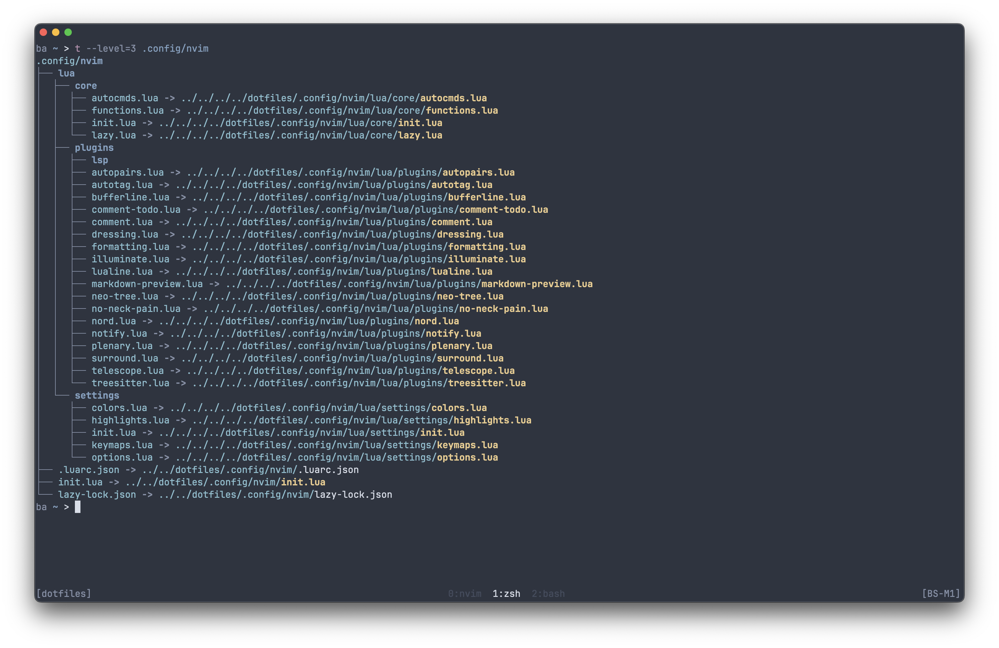

# Dotfiles

A place to better manage and showcase my dotfiles.

This repository serves as both personal documentation and a loose guide for others—feel free to fork it, customize it to your needs, and use it as a foundation for your own setup.

My current setup consists of macOS (zsh) and Ubuntu (bash). Although I tried to account for the differences in environments, keep in mind that adjustments might have to be made depending on your system.

## How It Works

GNU Stow helps manage dotfiles by creating symbolic links from your home directory to the actual configuration files stored in a version-controlled directory. This means that you can keep your dotfiles organized in one place while maintaining the expected structure for your system.

Once installed, running `stow` will create a symbolic link for each file that is inside the directory you pass into it (except for [ignored files](https://www.gnu.org/software/stow/manual/stow.html#Ignore-Lists)), and then these will be placed inside the **parent directory** of where you ran the command.

This approach makes it easier to:

- Track changes with version control
- Share configurations across different machines
- Keep your dotfiles organized in one central location
- Quickly deploy your entire configuration on a new system

To learn more about using `stow` for your own needs or to just get a better idea of how it works, I suggest you read the [documentation](https://www.gnu.org/software/stow/manual/).

On the other hand, if you wish to replicate my current configuration then be sure to keep reading.


## Overview

##### Shell Configuration

- `.bashrc` / `.zshrc` - Main shell files that source modular components
- `.bash/` / `.zsh/` - Shell-specific settings, prompts, and plugins
- `.shell/` - Shared utilities used by both bash and zsh

##### Development Tools

- `.config/nvim/` - Plugin-ready, keymaps, and custom Nord theme
- `.config/tmux/` - Vim-style navigation and simple status line
- `.gitconfig` / `.gitignore_global` - Aliases, settings and ignore patterns

##### System Integration (macOS)

- `.config/yabai/` - Tiling window manager settings
- `.config/skhd/` - Hotkey daemon for window management shortcuts
- `.config/ghostty/` - Terminal emulator settings

##### Utility Files

- `.stow-local-ignore` - Files and directories to exclude from stowing

## Requirements

Install the following directly or with your preferred package manager:

- [`bat`](https://github.com/sharkdp/bat)
- [`eza`](https://github.com/eza-community/eza)
- [`fzf`](https://github.com/junegunn/fzf)
- [`git`](https://git-scm.com)
- [`nvim`](https://neovim.io)
- [`rg`](https://github.com/BurntSushi/ripgrep)
- [`stow`](https://www.gnu.org/software/stow/)
- [`tmux`](https://github.com/tmux/tmux)
- C compiler
- [Nerd Font](https://www.nerdfonts.com)

## Getting Started

Clone this dotfiles repository in your `$HOME` directory and `cd` into it:

```
git clone https://github.com/bastnsa/dotfiles.git
cd dotfiles
```

Use `stow .` to create a symbolic link for every file in `~/dotfiles`:

```
stow .
```

If you receive an error, then it's likely you have a file (or files) with matching relative paths present in your home directory. For example, it is possible that a `.bashrc` or `.zshrc` file already exists in your home directory.

My recommendation is to back up any conflicting files, then `cd` back into `~/dotfiles` and finally proceed with the previous command:

```
stow .
```

Finally, if everything went according to plan, you should see symbolic links in your home directory that link back into the dotfiles directory.



## Important to Note

#### Adding Files

When customizing your dotfiles setup, remember that any new configuration files you add to the dotfiles directory will need to be "stowed" to create the appropriate symbolic links. After adding a new file, simply run `stow .` from within your dotfiles directory. This ensures that a symbolic link is created in your home directory that points to your new configuration file. Without this step, your system won't recognize or use the new configuration file since no symbolic link will exist.

Feel free to reach out if you need help with any issues or have questions.
